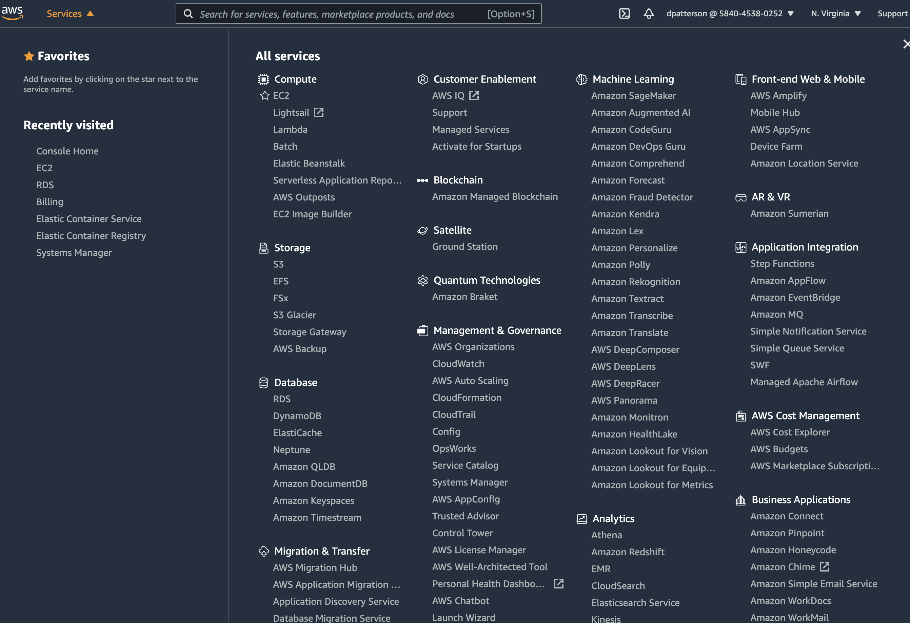
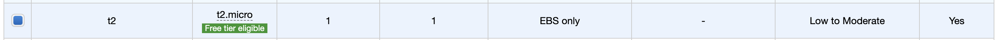
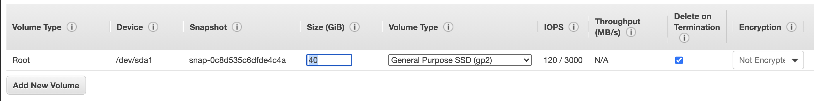
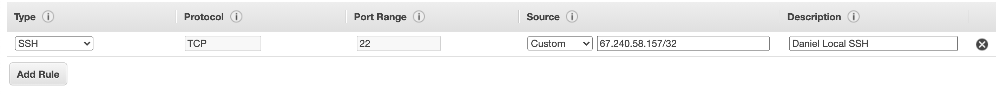

## Launching an EC2 instance 

This tutorial includes steps to launch an Amazon Web Services (AWS) EC2 instance. This tutorial focuses on launching an Ubuntu 20.04 instance. 

 ### Vocabulary: 

**EC2 instance**: Part of Amazon.com's cloud computing platform, an EC2 instance is a virtual computer where users can run their applications. 

**Security Group**: a virtual firewall for your instance to control inbound and outbound traffic. [Read more about security groups here](https://docs.aws.amazon.com/vpc/latest/userguide/VPC_SecurityGroups.html)

**Key Pair**: consists of a **private key** and a public key. It is a credential configuration to connect with your EC2 instance, which you can do via an SSH tunnel. As you tunnel in, you'll be prompted for the private key, which is stored as a .pem file somewhere on your local computer. A unique private key (.pem file) can be generated for each instance, or you can use one that already exists for another instance. The latter is preferred because a single key cuts down on the number of .pem files linked to different instances. These are configured at the launch phase of a given instance. 

### What You'll Need

<ul> 
<li> Basic familarity with Linux command line. </li>
<li> AWS login credentials. IT will be your best resource to establish AWS login credentials. It's probably best to link the login credentials to a project to connect with a project budget. </li>
<li> If you plan on launching anything other than a free instance (which aren't always free), you'll need an account to bill. </li>
</ul> 

### Getting Started

**Step 1: Log-in** 

Log-in to your AWS account where you'd like to create the instance.
  - https://aws.amazon.com/

User log-ins for projects at Toole Design have been created as IAM users. The screenshot below highlights the login screen for an IAM user (as of 4/2021)

**Step 2: Select Services**

Click the 'Services' button in the top left corner. You should see one of the largest drop-down menus on the internet (approximately). 

**Step 3: Select EC2** 

Under 'All Services', there should be a 'Compute' group. Under that group, select the 'EC2' option. 

**Step 4: Launch Instance** 

About half way down the screen, you should see a 'Launch Instance' box. Click the orange button that says, 'Launch Instance'. In the dropdown, select, 'Launch Instance'. 

**Step 5: AMI** 

You should now see a number of Amazon Machine Images (AMI) to choose from. In a nutshell, you're selecting the operating system, application server, and applications. In this walkthrough, we're focused on building an Ubuntu 20.04 system, which is free and open-source, and generally good - so select that. Ensure you chose the 64-bit (x86) architecture. I've found that x86 works for the work I've done. I once tested a Shiny application on ARM architecture and wasn't able to get it running with about 20 minutes of testing. I could have easily missed something. If you want to dig into this to provide additional detail on when to select ARM over x86, here are a few readings: 
 - [Stack Overflow](https://stackoverflow.com/questions/14794460/how-does-the-arm-architecture-differ-from-x86) 
 - [Reduced instruction set computer Wiki](https://en.wikipedia.org/wiki/Reduced_instruction_set_computer)
 - (Complex instruction set computer)[https://en.wikipedia.org/wiki/Complex_instruction_set_computer]

**Step 6: Instance Type** 

In the next screen you'll select your instance type. The main thing to remember here is that you're selecting a combination of CPU, memory, storage, and networking capacity. As these resources increase in power, so does the bill. Oh, and static memory is parameterized later on. 

For now, select the free tier (at the time of writing this, the free tier was the t2.micro type). Then click the 'Next: Configuration Instance Details' button. You can click the 'Review and Launch' button, but you'll miss out on parameterizing your instance. 

#### Resources on Instance Types 
- [EC2 Cost Calculator](https://aws.amazon.com/ec2/pricing/)
- [Instance Type Details](https://aws.amazon.com/ec2/instance-types/)

**Step 7: Parameters**
There are several parameters on this screen that you can adjust. Some come with additional charges. The two I pay attention to are the 'Network' and the 'Subnet' parameters. These parameters can put your instance in a physical region, which is better if you're connecting to, say, a PostgreSQL database. However, these don't matter much if you're building isolated instances. If that's the case, you can move on without adjusting anything. 

Once you've adjusted these parameters, or not, click the 'Next: Add Storage' button. 

**Step 8: Storage** 

This is where you set your passive memory. Passive SSD gp2 memory is generally super cheap with AWS, so I wouldn't hesitate to add 30-40 Gbs of memory (Provisional memory can get expensive and is generally much faster than SSD). When writing this, the t2.micro instance defaulted to 8Gbs of SSD gp2; I'd increase this to at least 40 Gbs. 

After you've identified your storage, click 'Next: Add Tags'. 

#### Resources on AWS memory options 
- [SSD gp types](https://aws.amazon.com/blogs/aws/new-amazon-ebs-gp3-volume-lets-you-provision-performance-separate-from-capacity-and-offers-20-lower-price/#:~:text=Even%20though%20gp2%20offers%20a,storage%20they%20don't%20need.&text=Customers%20looking%20for%20higher%20performance,max%20throughput%20of%20gp2%20volumes.)
- [Provisional vs SSD](https://docs.aws.amazon.com/AWSEC2/latest/UserGuide/ebs-volume-types.html)

**Step 9: Tags** 

You can skip through this. Click 'Next: Configure Security Group'

**Step 10: Configure Security Group** 

It's imporant to know that you can adjust the security group configuration after you've launched you instance. So don't feel held to your choice here. 

As a vocab reminder, a security group acts as a virtual firewall for your instance to control inbound and outbound traffic. Traffic is controlled at the IP address level. This means you can permit individuals to enter or call from the instance by their Public IPv4 IP address. 

**First:** Notice near the top that you can 'create a new security group' or 'select an existing security group'. An existing secrity group might be linked to another instance you've launch or detached and 'lying around' so-to-say. 

**Second:** If you know of an existing security group that you'd like to use, select that and click 'Review and Launch'. 

However, if you'd like to create a new security group, you can give it a name and description in fields below the 'Assign a security group'. 

**Third:** Add the security details into the interactive table. Notice that you'll want the '/32' after an individuals public IP address.  If that's not there, you'll get a error that reads: The source needs to be a CIDR block or a Security Group ID.

**Important Note:** The IP address  0.0.0.0/0 means public, or everyone. So for example the example below would mean anyone can SSH tunnel into the EC2 instance if the private key is avaiable. Where this might be preferred is for HTTP or HTTPS calls, which is configured in the left hand column named 'Type'. 

**Last:** Once you've configured your security details, click 'Review and Launch'.

**Step 11: Review**

At this point, you want to review the instance configuration and if all looks OK, then click 'Launch'. 

Now, you will be prompted with a popup  that prompts you to select an existing key pair or create a new key pair. If you missed what a key pair is, scroll up to the Vocab section above. There's information on this configuration there. Whichever you select, make sure you keep the .pem (private key) file safe. It'll be important to log into the instance. 

Once you've selected your key pair. Click 'Launch Instance'. 

You should now see this screen. 

You can click the 'View Instances' button near the bottom left side of your screen. This will take you to another screen where you can select your newly created instance. By clicking on that link, you'll be taken to the Instance Summary Screen. This is kind of a command center for your instance, and we'll use this page to connect to your instance in the next walk through. 

Congrats you've launched an EC2 instance! 

