## Connect to an EC2 instance with PuTTY 

This tutorial includes steps to connect to an EC2 instance via PuTTY.

### Vocabulary 

**Secure Shell Protocol (SSH)**: provides a secure connection over an unsecure network with encryrption. You can read more about SSH tunnels on [Wikipedia](https://en.wikipedia.org/wiki/Secure_Shell_Protocol). 

**PuTTY**: an open source software that supports SSH connections. You can read more about PuTTY [on this site](putty.org).

### What You'll Need 
- Basic familiarity with Linux command line, 
- PuTTY installed on your local computer,
- Your private key (.pem) file readily available,
- A running EC2 instance,
- and IMPORTANTLY: a .ppk file created with PuTTYgen from your AWS private key (.pem) file.

### Getting a .ppk file 

If you haven't already converted your private key (.pem) file Sinto a .ppk file, then please follow the steps under 'Convert your private key using PuTTYgen' [in this link](https://docs.aws.amazon.com/AWSEC2/latest/UserGuide/putty.html).  

### Notice

This guide walks through: 
1. Ensuring your EC2 instance is running 
2. Setting up your security group for your EC2 instance to allow you to connect with an SSH client. 
3. Logging in to your EC2 instance. 

If you know your EC2 instance is running and you've already set up the security group for your instance to allow for your local IP address to SSH tunnel in, skip ahead to step 4.

**Step 1: Verify Your Instance is Running**: 

Log into your AWS account and ensure your EC2 instance is running properly. You can access your instance by selecting <i>Services</i>, then <i>EC2</i>. Near the top, you should see a box with the phrase 'Instances (Running)'. It should look something like the screen shot below. 

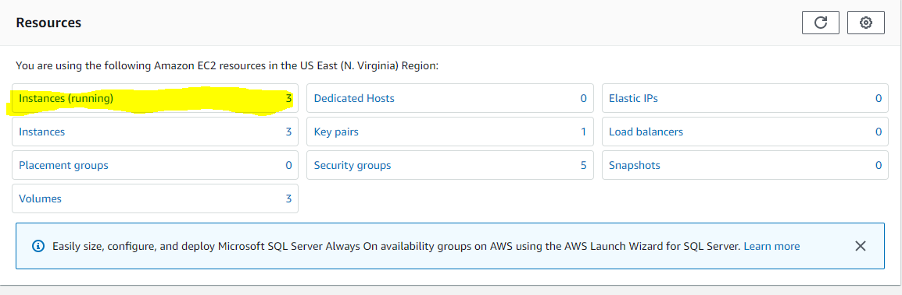

Click on the 'Instances (Running)' link, this will take you to a screen where you can verify your instance is running. See the image below, your instance should show the same checks (Running and Checks Passed). 

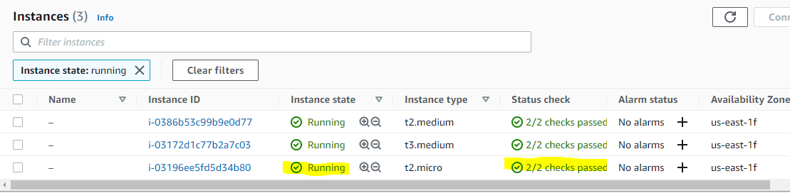

Once verified, click on the Instance ID that you want to connect with. 

**Step 2: Check Security Credientials**

Once you've clicked on your Instance ID, select the 'Security' tab (highlighted below).

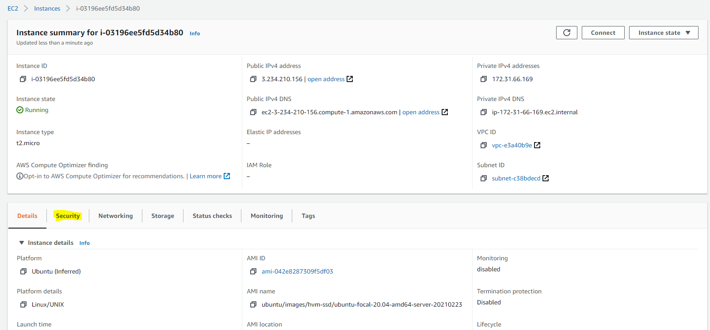

Then click on the security group that manages your inbound traffic. If starting off, you'll likely only have one security group.

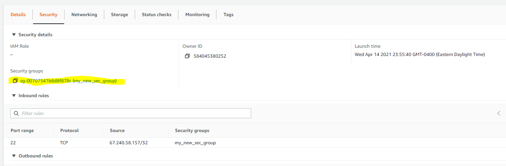

Here you can ensure your local IP address has SSH privileges. If so, skip ahead to step 4. 

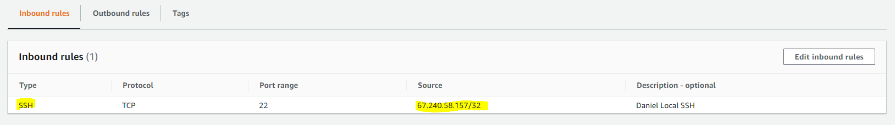

**Step 3: As Needed, Add An Inbound Security Detail** 

If you don't see your local IP address listed with SSH privlages, you can add it by clicking the 'Edit Inbound Rules' button.

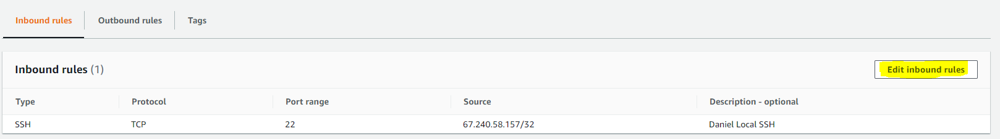

Then click 'Add rule'. 

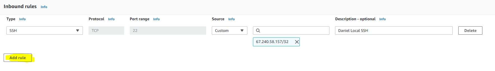

You should see an additional row appear on the inbound rule box. Under Type, select SSH. The port range could automatically populate to 22. Next add your local IP to the box between the Source and Description columns. Ensure your IP address has '/32' attached to the right side. So, for example, my local private IP address is, '67.240.58.157', I would write this into the box as '67.240.58.157/32'. Also, I find it useful to add a description for each detail. 

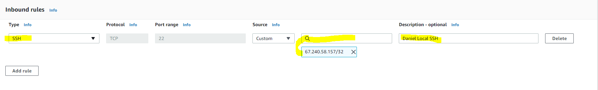

Once you've set this up, click 'Save Rules' near the bottom right corner. 

**Step 4: Log In to Your EC2 Instance** 

As a reminder, if you haven't already converted your private key (.pem) file into a .ppk file, then please follow the steps under 'Convert your private key using PuTTYgen' [in this link](https://docs.aws.amazon.com/AWSEC2/latest/UserGuide/putty.html).

Grab the Public IPv4 DNS address for your instance. This can be found in your Instance Summary portal (same place where you selected the 'Security' tab). 

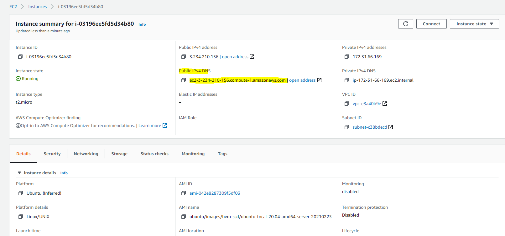

Once you've located this, open PuTTY from your start menu. 

Copy the Public IPv4 DNS address into the Host field in your PuTTY window. Then, ensure the port is set to 22 and the 'Connection Type' is set to SSH.

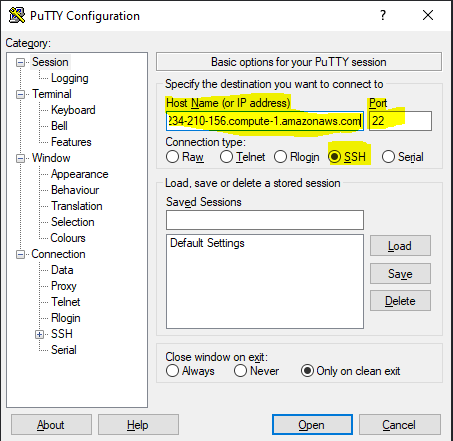

Then under the 'Category' section on the left, expand 'Connection' and click 'Auth'. The screen to the left should now have a 'Private Key for Authentication' field with a 'Browse' button to the right. 

Click the 'Browse' button and locate your .ppk key. If you haven't already created a .ppk file from your AWS private key file (.pem), then scroll back up for instructions on how to do that.

Once you've loaded your .ppk file, click 'Open'.

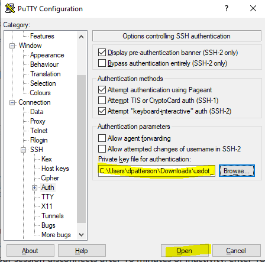

If this if the first time you're opening your connection, you'll be prompted with a security verification. The server host is not loaded onto our local computer, by by clicking 'Yes', you'll add it, which allows you to move onto the next step. 

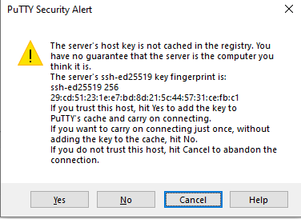

At this point, you'll be asked for username of your EC2 instance. [Here's a list of the default names for different AIMs](https://linuxroutes.com/default-usernames-aws-for-logging-on-to-different-linux-distros-ec2-instance/). By default, the Ubuntu distro name is 'ubuntu'. 

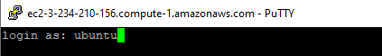

Click enter, and you should be logged in. 

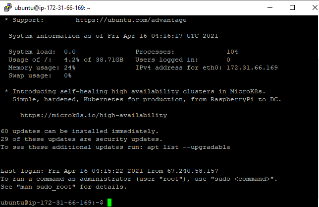

Congrats!
